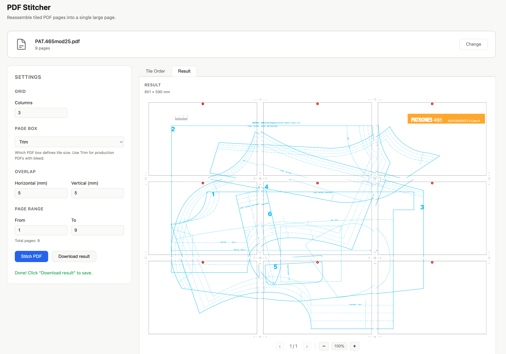

# PDF Stitcher

Browser-only PDF imposition tool. Reassemble tiled PDF pages into a single large output page. No server — files never leave your browser.

**Live:** https://pdf.atelier-feldegg.ch



---

## How to use

1. **Drop or browse** a PDF onto the drop zone.
2. **Arrange tiles** in the *Tile Order* grid — drag to reorder, `+` to insert a blank, `×` to remove.
3. **Adjust settings** in the controls panel:
   - *Columns* — how many tiles per row
   - *Page Box* — which PDF box defines the tile size (Trim recommended for production PDFs with bleed)
   - *Overlap* — horizontal/vertical overlap between adjacent tiles, in mm
   - *Page Range* — subset of source pages to use
4. **Click *Stitch PDF*** — the result appears in the *Result* tab.
5. **Download** the stitched PDF.

---

## Features

### Tile grid
- Visual thumbnail grid (2× resolution) matching the configured column count
- Drag-and-drop to reorder tiles
- Insert blank tile before any position (`+` button, on hover)
- Remove any tile (`×` button, on hover)
- Reset to natural page order

### Imposition
- Arbitrary grid layout: set columns, rows are derived automatically
- Configurable horizontal and vertical overlap (mm)
- Page range: process a subset of pages
- Page box selector: Trim / Media / Crop / Bleed / Art
- Correct handling of rotated pages (`/Rotate 90/180/270`)

### OCG layers
- Detects Optional Content Groups (layers) in the source PDF
- Layer list appears when multiple layers are present; toggle visibility
- Disabled layers are suppressed in the stitched output

### Encrypted PDFs
- Automatically decrypts encrypted PDFs via mupdf.js (WASM) before stitching

### Viewer
- Result PDF viewer with pan, zoom, and multi-page navigation
- Result dimensions shown in mm in the viewer subtitle
- Download filename includes output dimensions (e.g. `file-420x594.pdf`)

---

## Development

```bash
npm install
npm run dev        # start Vite dev server
npm run build      # type-check + production build
npm run typecheck  # type-check only
```

**Stack:** Vue 3 · TypeScript · Vite · pdf-lib · pdfjs-dist · mupdf.js (WASM, lazy-loaded)

---

## Deployment

Push to `main` triggers a GitHub Actions workflow that builds and deploys to GitHub Pages at `pdf.atelier-feldegg.ch`.
